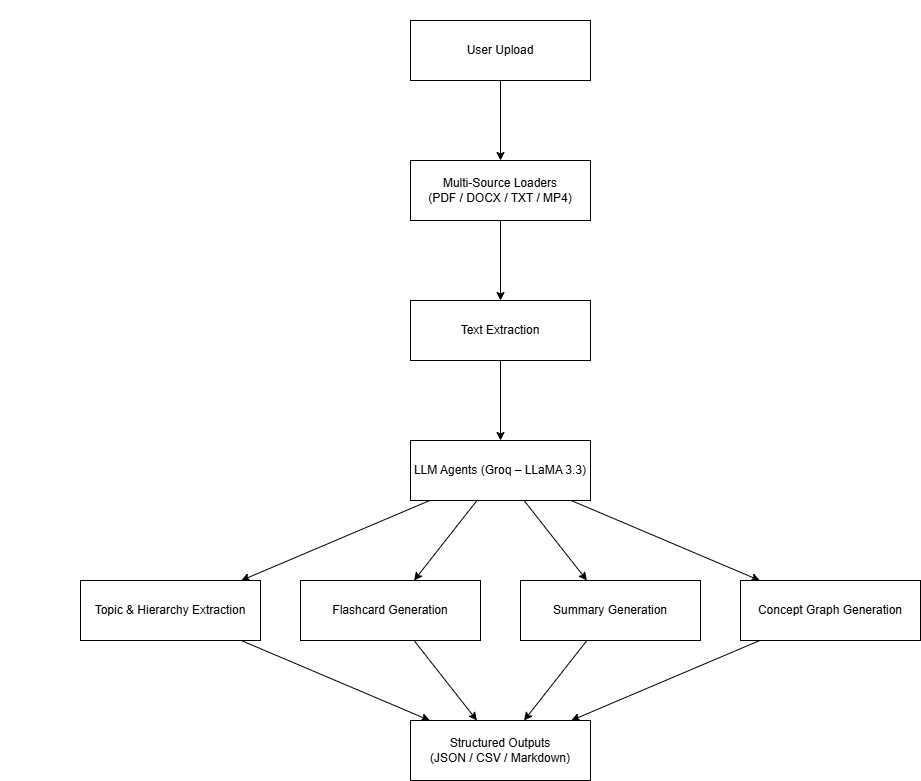

# Multi-Source Learning Content Ingestion & Structured Output Generation

> Challenge 6 Submission

An AI-powered system that ingests learning content from documents and videos and automatically generates structured educational artifacts such as flashcards, summaries, and concept graphs, making unstructured content easy to learn, revise, and reuse.

---

## Demo

Project Demo

```markdown

````

The demo shows:

* Uploading a document or video
* Automatic text extraction
* One-click generation of learning artifacts
* Flashcard and concept graph preview in UI

---

## Problem Statement

Learning content is often scattered across PDFs, documents, transcripts, and videos.
Manually converting this content into structured learning materials such as notes, flashcards, and concept maps is time-consuming and inefficient.

This project solves that problem by:

* Ingesting content from multiple file types
* Extracting key concepts and topic hierarchies
* Automatically generating structured, reusable learning artifacts

---

## What the System Does

### Input

* PDF documents
* DOCX files
* TXT / transcript files
* MP4 videos (auto-transcribed)

### Output

* Flashcards (JSON and CSV)
* Structured summary (Markdown)
* Concept graph (JSON and visual graph)

---

## System Architecture




---

## Project Structure

```
HACKETON/
│
├── app.py            # Streamlit UI & orchestration
├── loaders.py        # File & video ingestion
├── agents.py         # LLM-powered AI agents
│
├── outputs/
│   ├── flashcards.json
│   ├── flashcards.csv
│   ├── summary.md
│   └── concept_graph.json
│
├── requirements.txt
├── .env
└── README.md
```

---

## Key Design Decisions

### Single-Document Processing (By Design)

* Each session processes one content source
* Ensures coherent learning artifacts
* Reduces topic mixing and ambiguity
* Easily extendable to multi-document ingestion

### Stateless Output Handling

* Outputs are regenerated per upload
* Keeps the system simple, fast, and demo-safe

---

## Tech Stack

* Frontend/UI: Streamlit
* LLM: Groq (LLaMA-3.3-70B-Versatile)
* Speech-to-Text: AssemblyAI
* Document Parsing: PyPDF, python-docx
* Data Handling: Pandas
* Graph Visualization: NetworkX, Matplotlib

---

## Setup Instructions

### 1. Create Virtual Environment

```bash
python -m venv venv
venv\Scripts\activate
```

### 2. Install Dependencies

```bash
pip install -r requirements.txt
```

### 3. Environment Variables

Create a `.env` file:

```env
GROQ_API_KEY=your_groq_api_key
ASSEMBLYAI_API_KEY=your_assemblyai_api_key
```

### 4. Run the App

    
    streamlit run app.py
    

---

## Example Use Cases

* Students converting lecture slides into flashcards
* Professionals extracting learning modules from training videos
* Educators creating structured material from raw content
* Self-learners turning PDFs into revision-ready artifacts

---

## Future Enhancements

* RAG-based Question Answering
  Add embeddings and vector retrieval for grounded question answering.

* Multi-Document Ingestion
  Enable cross-file concept merging and topic aggregation.

* Adaptive Learning Paths
  Use concept graph structure to recommend learning sequences.

* Advanced Retrieval
  Topic-based semantic search and flashcard filtering by difficulty.

---

## Conclusion

This project demonstrates how large language models can be combined with multi-source ingestion pipelines to convert unstructured learning content into structured, reusable, and intelligent educational resources. The architecture is modular, extensible, and suitable for real-world learning and knowledge management applications.


---

